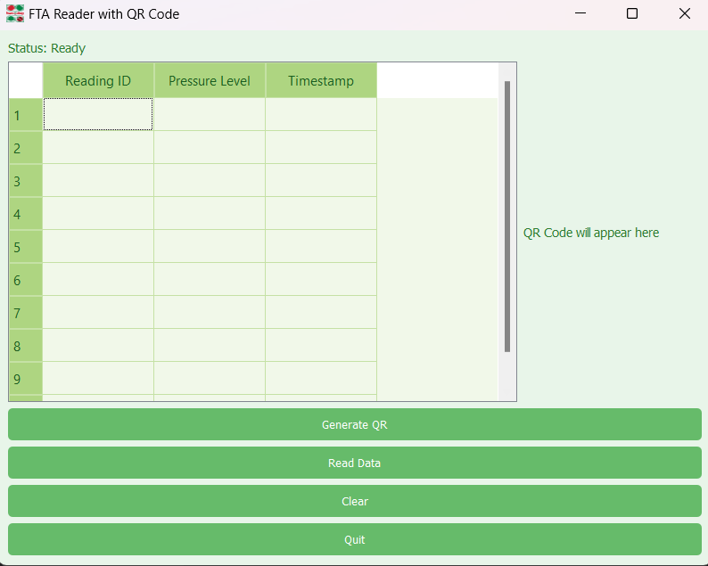

FTA Reader with QR Code Generator
Overview
The FTA Reader with QR Code Generator is a PyQt5-based application designed to:

Load and display data from a CSV file.
Generate a QR Code from the data.
Present a user-friendly interface with a green-themed GUI.
This application is ideal for visualizing tabular data and converting it into a QR code for easy sharing or archival.

Features
CSV File Support: Load data from CSV files and display it in a table format.
QR Code Generation: Generate a QR code from the loaded data.
Green-Themed Interface: A clean and visually appealing green GUI theme.
Responsive Layout: Adapts to various screen sizes, ensuring usability.

Installation
Clone or download this repository:

bash
Copy code
git clone https://github.com/twigs538/Pressure-Barcode-Converter.git
cd Pressure-Barcode-Converter
Install required Python packages:

bash
Copy code
pip install PyQt5 pandas qrcode
Usage
Run the application:

bash
Copy code
python fta_reader.py
Features:

Load CSV Data:
Click on the "Read Data" button.
Select a CSV file with the structure:
sql
Copy code
reading_id,pressure_level,timestamp
001,45,2024-10-01 12:00:00
002,30,2024-10-01 12:05:00
View Data:
The contents of the CSV will populate the table.
Generate QR Code:
The QR code is automatically generated from the loaded data and displayed on the interface.
Quit Application:
Click the "Quit" button to exit.

Application GUI
Key Elements:
Table: Displays the contents of the loaded CSV file.
Buttons:
Connect to FTA: Placeholder functionality for future connectivity.
Read Data: Loads CSV data into the table and generates a QR code.
Quit: Closes the application.
QR Code Display: Displays the QR code generated from the CSV data.
Status Bar: Shows the current status (e.g., "Ready", "Data Loaded").
Green Theme
The GUI features a light green theme with visually appealing elements, ensuring a user-friendly experience.

Example Screenshot

Contact
For questions or feedback, contact tmoloko538@gmail.com